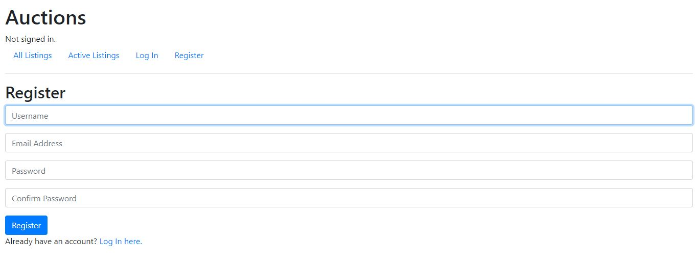
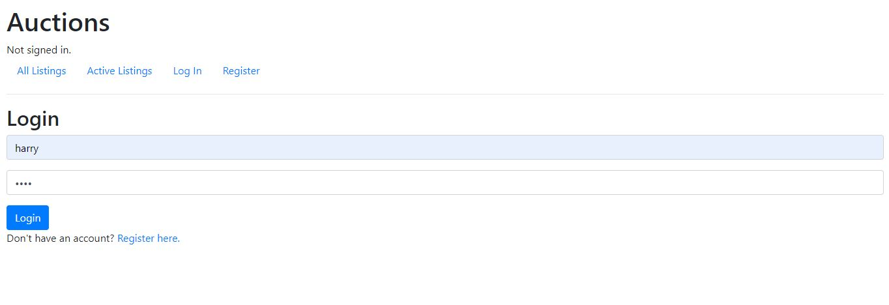
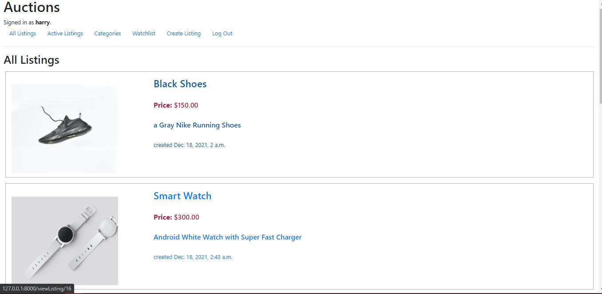
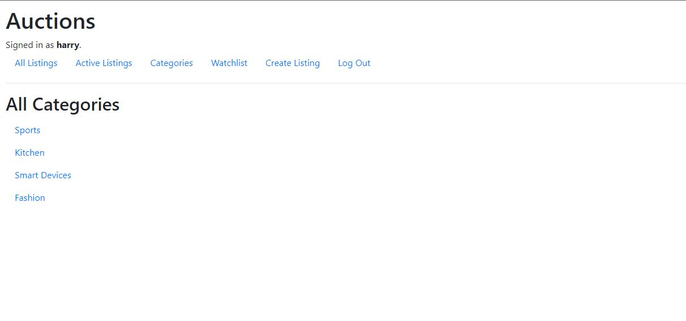
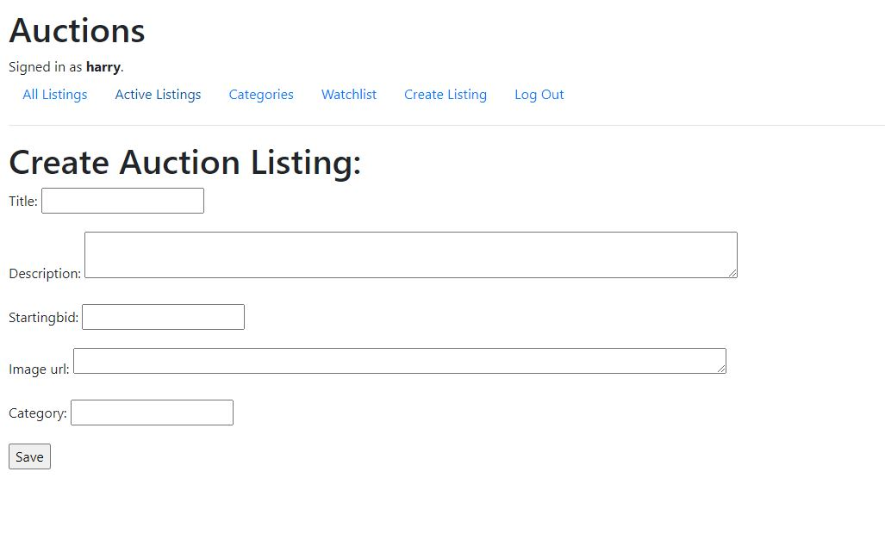

# Commerce
 an eBay-like e-commerce auction site that will allow users to post auction listings, place bids on listings, comment on those listings, and add listings to a “watchlist.”

## Snippets
| |
| :------------: |

| |
| :------------: |

| |
| :------------: |

| |
| :------------: |

| |
| :------------: |

| |
| :------------: |

| |
| :------------: |

| |
| :------------: |

## Requirements
- Python3

## Installation
- Clone the repository , use  `git@github.com:Omar-Hakem/Commerce.git` 
- #### open terminal and change the Directory to the project directory, use the following commands:
  ##### ``` cd Commerce ```
  ##### ``` python -m venv venv ```
  ##### ``` venv/Scripts/activate ```
  ##### ``` pip install -e . ```
  ##### ``` python manage.py runserver ```
- then open your browser and enter the following url:
  ##### localhost:8000

## Built With
- HTML
- CSS
- Python

## Author

## 👤 Omar Abd ElHakem
- GitHub: [@Omar-Hakem](https://github.com/Omar-Hakem)
- LinkedIn: [LinkedIn](https://www.linkedin.com/in/omar-abd-elhakem-abd-elfattah94/)
